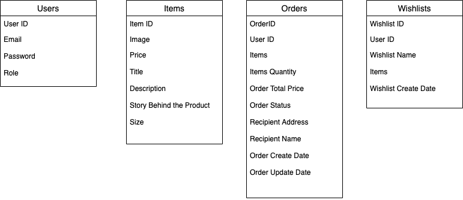
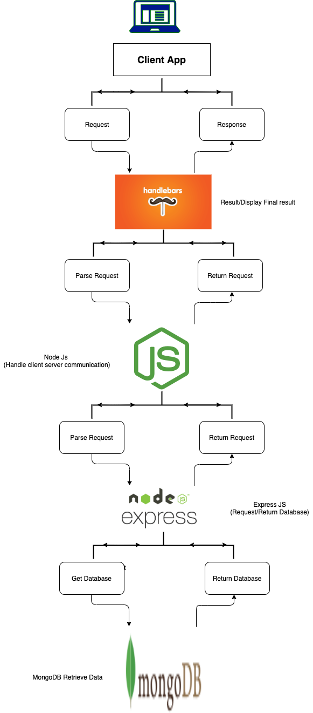

## CreameryOn-AClick

`Node.js` is an open-source, cross-stage runtime condition based on Chrome's V8 JavaScript motor. It is utilized to manufacture quick, versatile server-side web applications. The occasion driven, non-blocking I/O display makes Node.js lightweight and effective. These highlights have propelled a great deal of engineers to embrace Node.js.

This project is `CreameryOn-AClick` is basically an online store for everyone’s favorite summer snack, ice cream. The users can visit the webpage and order their favorite ice-cream and can enjoy it in the pleasure and safety of their homes. 

### Task:

Our objective is to create an online dessert shopping experience for our clients. 
We will be handling user authentication and authorization based on the roles. 

**User:**

A user can visit the webpage and browse through the options but will have to login to place an order. User has an option to get all the orders he placed or search for a particular order once loggedin. Also, any new user can search for a particular product using the search option. 

**Admin:**

An 'admin' will have full control on the webpage. He can add, edit or delete an item, retireve all the orders placed and even delete a user (if need be). Also, an Admin can create a new category say waffles or cakes for the users to have more options to buy from. He can also update the Home Page and the about us page. 

### Models:

1.	Users: User and Admin information is added to database with Unique ID based on their roles.

2.	Items: Complete products information is stored in this table.

3.	Orders: Customer ordered product details is stored in this table.

4.  Auctions: We are planning to add an auctions page where the admin or the sellerwill put the ice-creams on auction               (starting at 10% of original cost) for the users and the highest bidder will get that item on the                     bidding amount. The auctions table will store all the details for a particular auction created. 
   
5. Bids: Customers placed bids for the auctions will be stored in this table.

6. Transactions: For each product in an order, there will be a transaction ID and all the information related will be stored in this table. (Optional)

  

### Routes: 

Some basic routes will be:

1. 	Login
		- Signup: POST /login/signup
		- Login: POST /login
		- Change Password POST /login/password

2.	Items (requires authentication)
		- Create: POST /items - restricted to users with the "admin" role
	    - Update an item: PUT /items/:id - restricted to users with the "admin" role
	    - Get all items: GET /items - open to all users
	    - Delete an itme: DELETE//items/:id - restricted to users with the "admin" role

3.	Orders (requires authentication)
		- Create: POST /orders - open to all users. 
    		 Takes an array of item _id values (repeat values can appear). Order should be created with a total field with the total cost of all the items from the time the order is placed (as the item prices could change). The order should also have the userId of the user placing the order.
		- Get my orders: GET /orders - return all the orders made by the user making the request but should give allorders if requested by users with the "admin" role.
		- Get an order: GET /order/:id - return an order with the items array containing the full item objects rather than just their _id. If the 'user' is a 'normal user' return a 404 if they did not place the order. An 'admin user' should be able to get any order.

4.  Auctions (require authentication)
    	- Create: POST /auctions - restricted to users with the "admin" role
	    - Update an item: PUT /autcions/:id - restricted to users with the "admin" role
	    - Get all items: GET /auctions - open to only admin
	    - Delete an itme: DELETE//auction/:id - restricted to users with the "admin" role

5.  Bids (requires authentication)
		- Create: POST /auctions/:id/bid - a user will create a bid on his id
		- Get all bids: GET/bids - a user can get all the bids he placed

### Data Flow Diagram:

### Request and Response Diagram from Front End to Database using Node JS to handle client-server communication.  

 

### Good to Have: 

Our primary plan is to be able to design the front end and the back end for the online icecream store webpage and it would be great if we would be able to add a payment page and connect it to Paypal by the end of this project.

